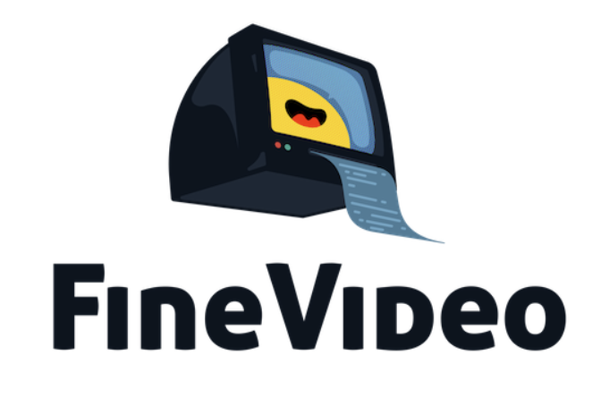
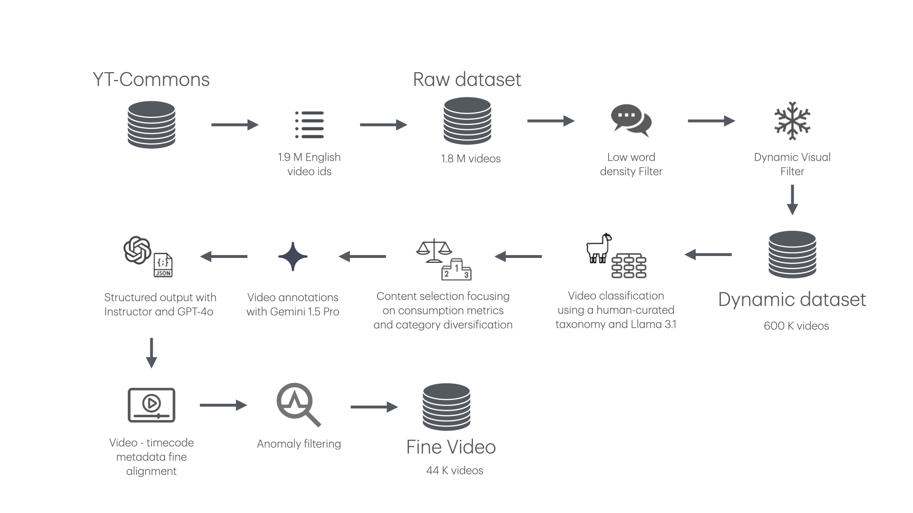

## Introduction

We recently released [FineVideo](https://huggingface.co/spaces/HuggingFaceFV/FineVideo-Explorer), a dataset with 43k+ videos/3.4k hours annotated with rich descriptions, narrative details scene splits and QA pairs. 

We cannot be more excited about the response of the community! If you have not seen FineVideo yet, take a look at it through the [dataset explorer page](https://huggingface.co/spaces/HuggingFaceFV/FineVideo-Explorer)


If you are interested in more technical details about the pipeline, we invite you to take a look at our [blog post](https://huggingface.co/).


## Content of the repository

This repository contains the code that we used in FineVideo to gather videos and annotate them. Those scripts cover all the different steps in the pipeline below.


The scripts are grouped in folders and each folder represent one or more steps of the pipeline:

```
├── rawdataset
│   ├── filter-yt-commons.py
│   └── ytdlps3
│       ├── Dockerfile
│       └── download_and_upload.py
├── dynamicfilters
│   ├── videodynamismfiltering
│   │   ├── Dockerfile
│   │   └── check_static.py
│   └── worddensityfiltering.py
├── videocategorization
│   ├── content_taxonomy.json
│   ├── create_prompts.py
│   ├── launchTGI-Slurm.sh
│   └── tgi_inference_client.py
├── contentselection
│   ├── content_taxonomy.json
│   └── oracle.py
├── contentannotation
│   ├── gemini_prompt.txt
│   └── video2annotation.py
├── finealignment
    └── video_alignment.py

```

Given the size of the content to scan and/or annotate, all the parts that require scalability are implemented as docker containers that can be launched in a distributed way or prepared to split a list of work in chunks and process specific chunks of it so that you can launch multiple instances of the same script to parallelize.

For example:
* video download `ytdlps3` and video dynamism filtering `videodynamismfiltering` are packaged as Docker containers. 
* video id gathering for the raw dataset `filter-yt-commons.py`, content selection `oracle.py` or word density filtering `worddensityfiltering.py` are scripts that process all the content at once
* content annotation `video2annotation.py`, video categorization `tgi_inference_client.py` & `create_prompts.py` and video-metadata alignment `video_alignment.py` are prepared to process chunks of a queue so that you can launch multiple instances of the same script.